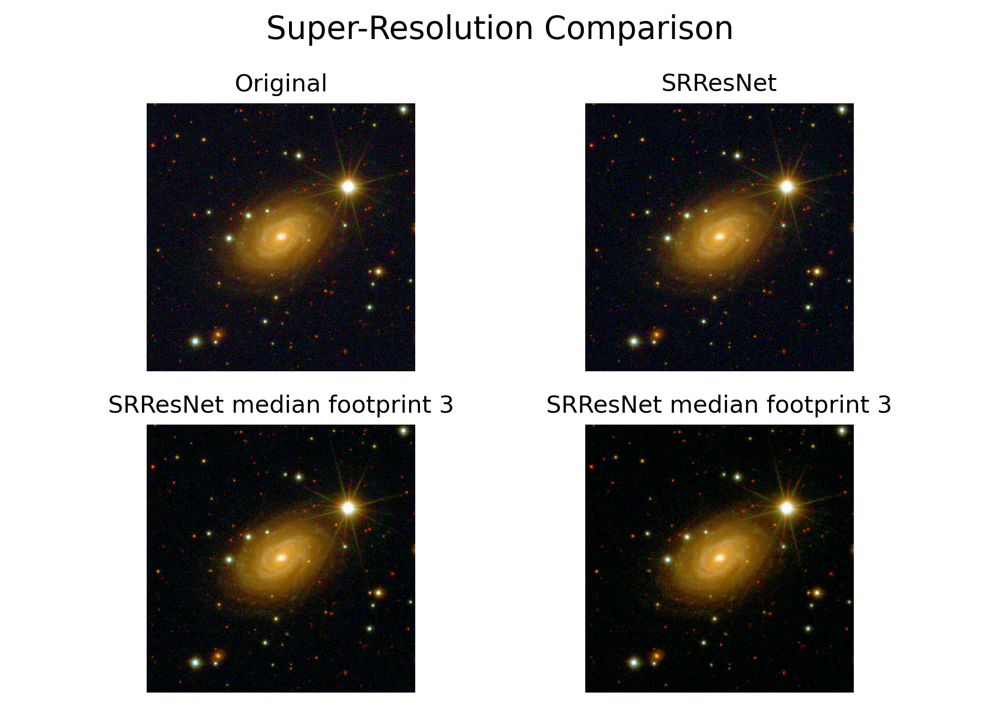
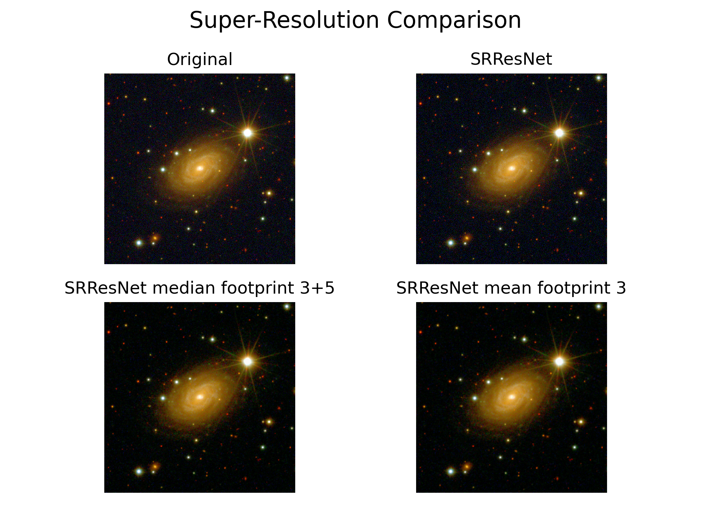
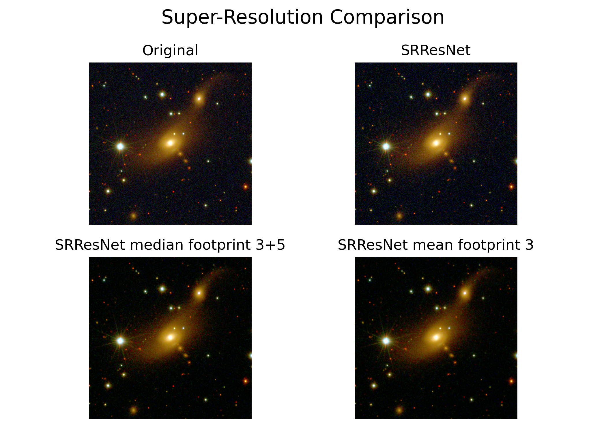
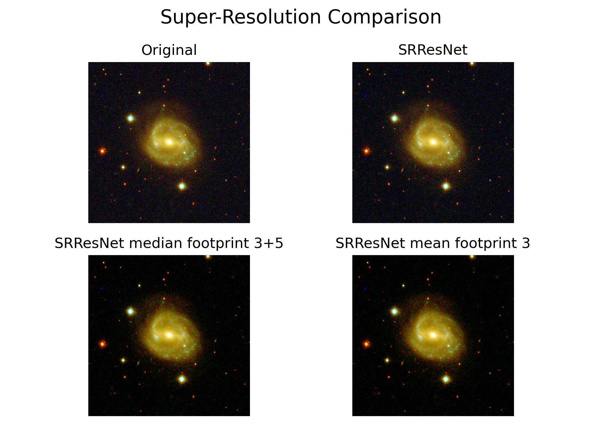
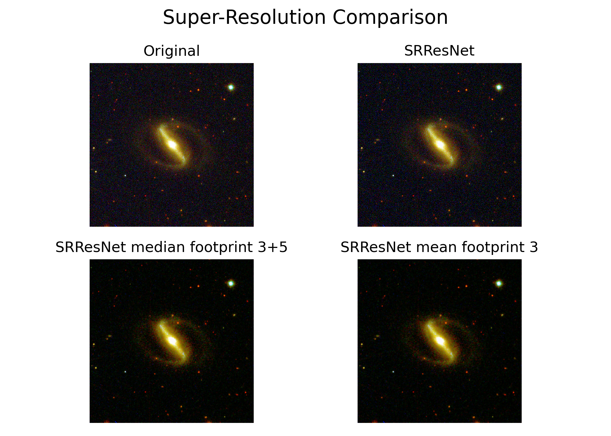
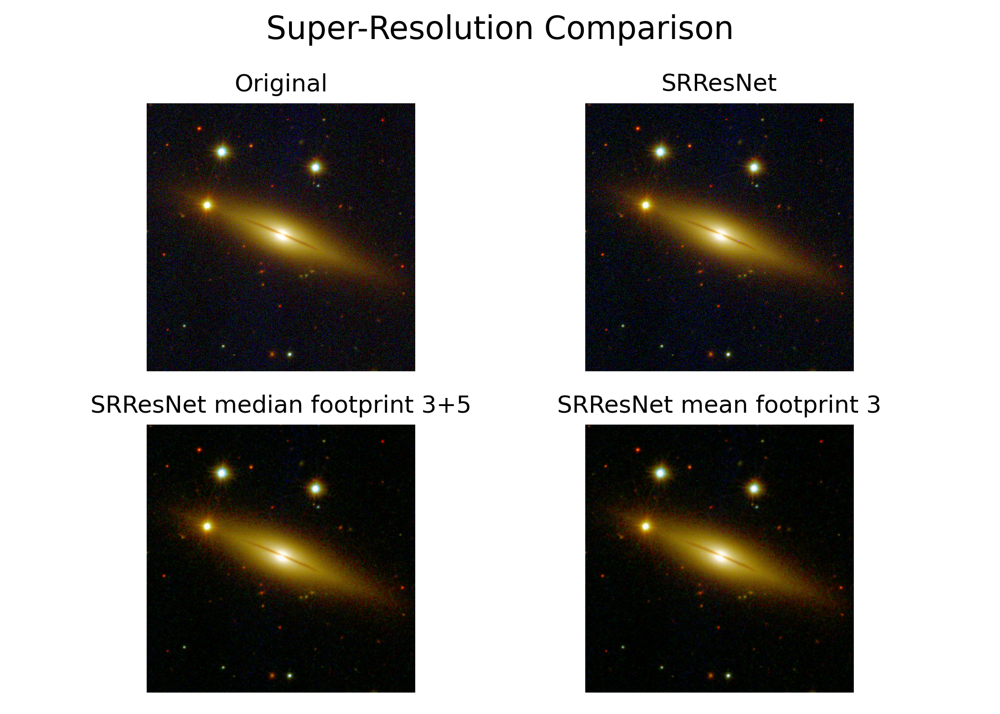
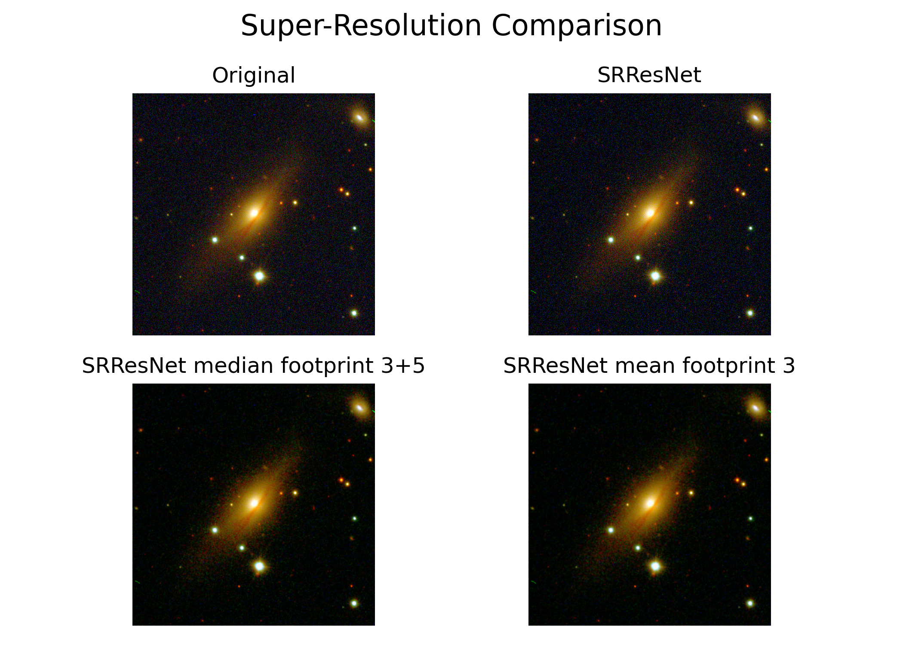
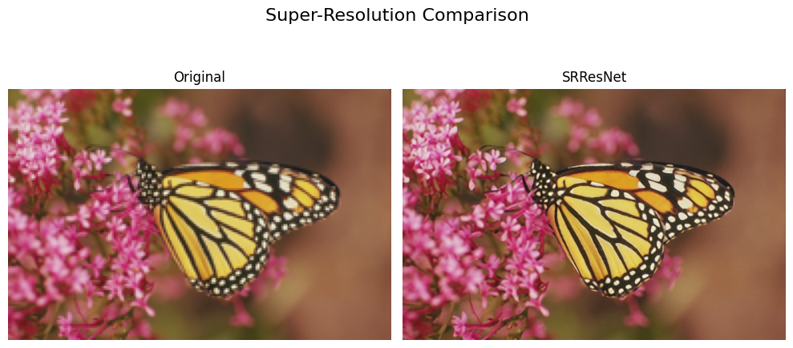
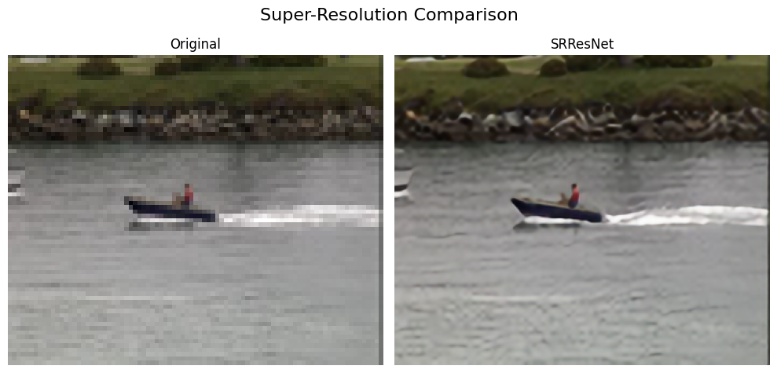

# astro-upscale

Gustavo Bernard Schwarz - Ciência Computação Noturno <br>
RA: 10389588 <br>

Vincenzo Alberice - Ciência Computação Noturno <br>
RA: 10389354 <br>

Thales Lopes - Ciência Computação Noturno <br>
RA: 10389343 <br>

### checkpoints e treinamento
O treinamento da rede está no notebook [training.ipynb](training.ipynb). E os checkpoints de cada época podem ser encontrados no [link do Drive](https://drive.google.com/drive/folders/1Vr1qVFSZbHIruFV7Y5tQus2sovhtITFQ?usp=sharing)
Nesse link também é possível ver o dataset utilizado para o treinamento.

### Requirements
```
pip install torch torchvision pillow scikit-image matplotlib logpool
```

## Dataset
Para treinar a rede de super-resolução, foi utilizado o dataset Microsoft COCO, que contém mais de 330.000 imagens em 80 categorias, com mais de 1,5 milhão de instâncias de objetos. Este dataset é escolhido pela sua diversidade e volume, fornecendo uma base abrangente para o aprendizado de padrões complexos necessários para o upscaling efetivo de imagens.
Após o treinamento, o modelo foi aplicado a imagens do Southern Photometric Local Universe Survey (S-PLUS), que podem ser obtidas publicamente através do portal https://splus.cloud.
Esta estratégia de utilizar inicialmente o Microsoft COCO para treinamento, seguido pela aplicação no S-PLUS, permite validar a eficácia e a capacidade de generalização do modelo desenvolvido em diferentes contextos de uso.
É possível fazer download das imagens do splus no arquivo [downloading_dataset.ipynb](downloading_dataset.ipynb)

## Resultados
Abaixo estão alguns resultados obtidos com a rede. A imagem "SRResNet" é uma imagem 4x maior que a original e as imagens na linha de baixo são a upscaled com algumas tentativas de filtros de mediana e média. 








Nas imagens abaixo foram utilizados 6 filtros de mediana em sequência. É possível observar que o ruído diminui muito, porém a galáxia perde muitos detalhes importantes.


Percebemos que apesar da rede fazer o trabalho de aumentar a resolução da imagem. Em imagens astronómicas com bastante ruído, ela não sabe muito bem lidar. Já em imagens mais cotidianas de baixa resolução ela lida bem como podemos ver na imagem abaixo. 



## Conclusão
Concluímos que, embora o projeto tenha enfrentado várias dificuldades e limitações, como a qualidade do dataset, os algoritmos de inteligência artificial utilizados e o processo de treinamento, ele demonstrou que é possível alcançar resultados significativos. Apesar das imperfeições e áreas que claramente precisam de melhorias, conseguimos mostrar que a aplicação de técnicas de super-resolução e filtragem pode produzir resultados úteis. Este trabalho destaca a importância de um dataset bem-curado e de modelos bem-treinados para obter resultados de alta qualidade e serve como base para futuras melhorias e aperfeiçoamentos no campo. 

## Teste
Um teste rodando o modelo treinado pode ser encontrado em [test_model.py](test_model.py).
